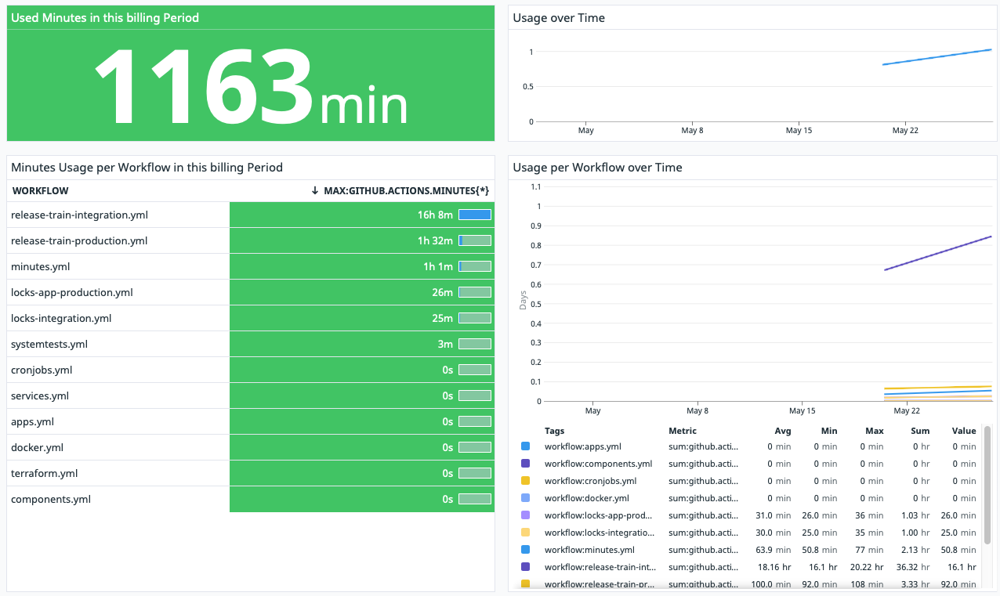

# Datadog Custom Metric for GitHub Actions Workflow Usage

GitHub Action to send minutes usage per workflow to a custom metric in Datadog. Here is an example of how it looks like in Datadog:



You'll be able to see the **usage for the current billing period** per workflow and in total across all defined workflows.

## Inputs

### `api_key`

**Required** Datadog API key e.g. from GitHub Actions Secrets.

### `app_key`

**Required** Datadog Application Key e.g. from GitHub Actions Secrets.

### `repo_path`

**Required** Repository path e.g. from standard variable.

### `wf`

**Required** Workflow name from strategy matrix.

### `tag_workflow_id`

**Required** Workflow name from strategy matrix.

### `github_tk`

**Required** Github Actions Token from GitHub Actions Secrets.

## Example usage

```yml
on:
  workflow_run:
    workflows: [Worfklow One, Workflow Two] # Runs when one of the workflow defined in the brackets is run and completed
    types:
      - completed
  schedule:
    - cron: 30 23 * * 1,3,5 # At 23:30 on Monday, Wednesday, and Friday
  workflow_dispatch:

jobs:
  updateWorkflowTimings:
    runs-on: ubuntu-latest
    strategy:
      matrix:
        WFs: [workflow_one.yml, workflow_two.yml] # Runs for each workflow defined in the brackets
    steps:
      - name: Use my action
        uses: goseind/datadog-gh-actions@v1.0.0
        with:
          api_key: ${{ secrets.DATADOG_API_KEY }}
          app_key: ${{ secrets.DATADOG_APPLICATION_KEY }}
          repo_path: ${{ github.repository }}
          tag_workflow_id: ${{ matrix.WFs }}
          wf: ${{ matrix.WFs }}
          github_tk: ${{ secrets.GITHUB_TOKEN }}
```